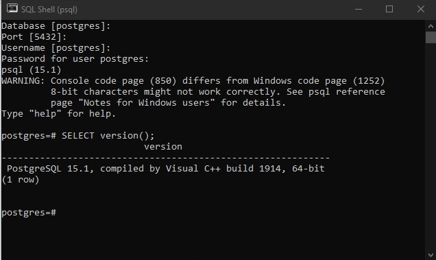
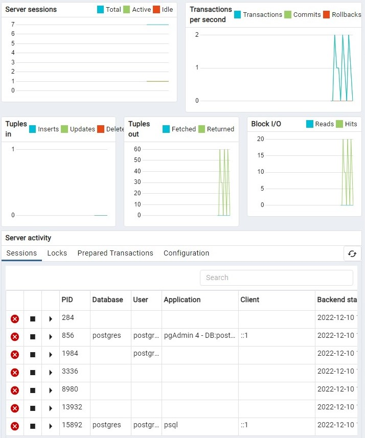
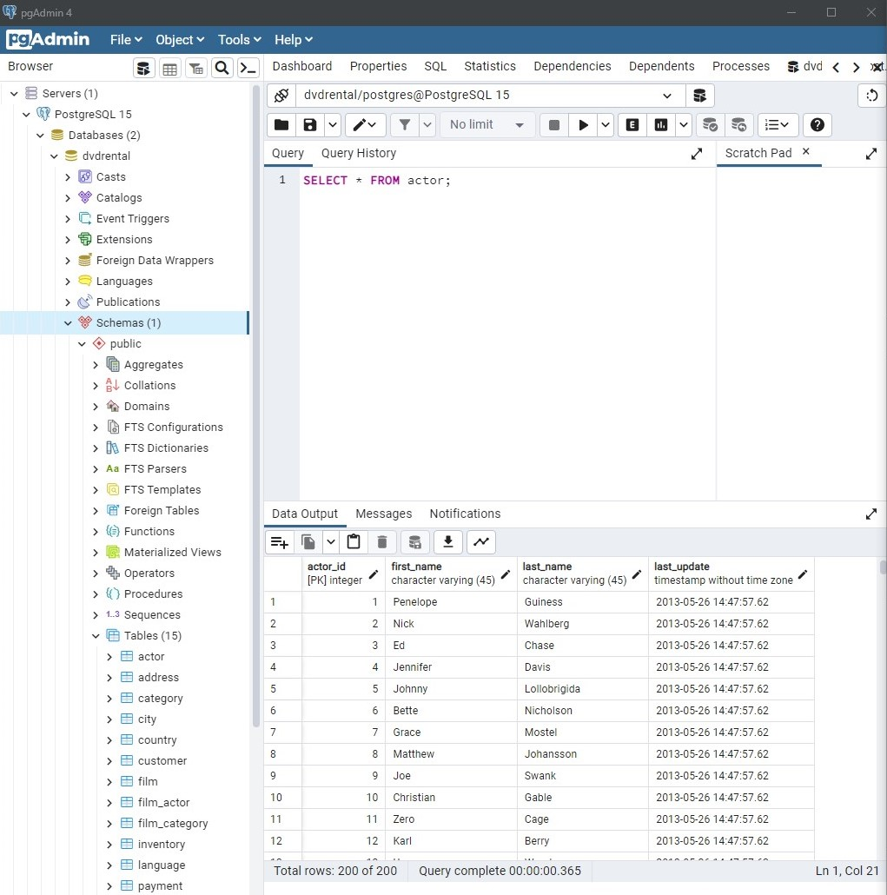
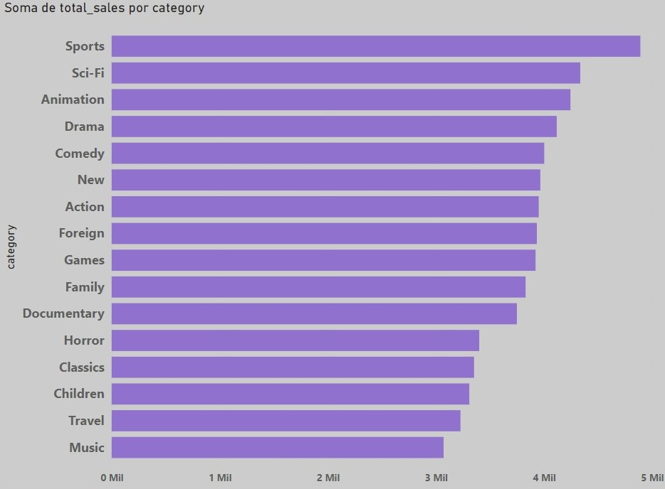
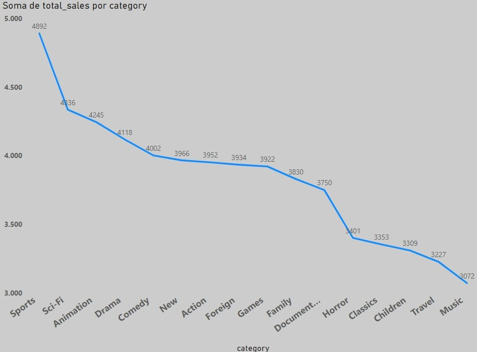
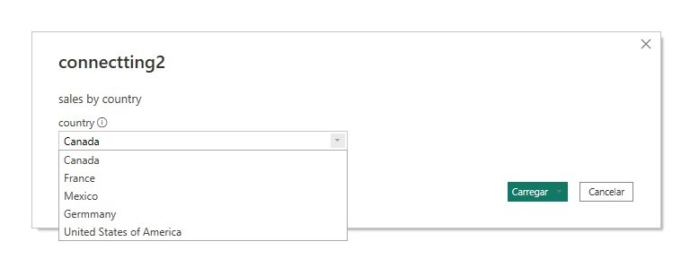
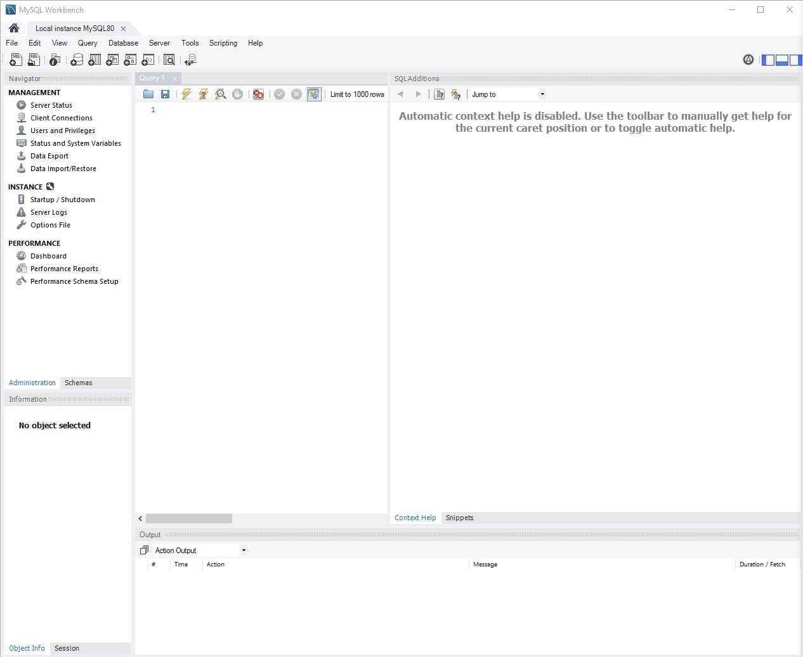
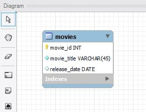
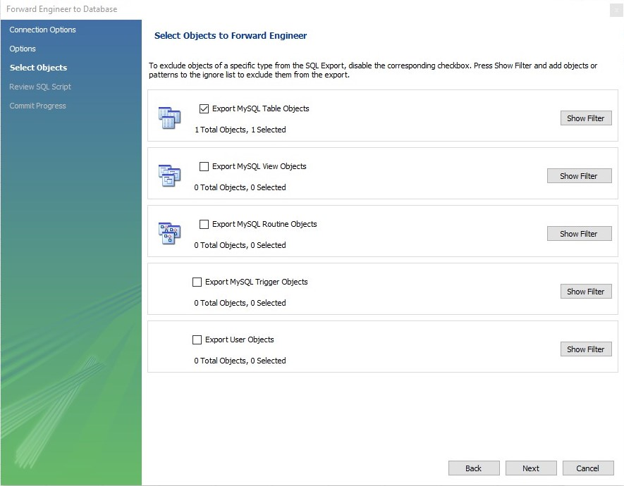

# bi_engineering

### em desenvolvimento

´´´
pg_restore -U postgres -d dvdrental C:\temp\dvdrental.tar
´´´

´´´
SELECT 
    MAX(replacement_cost)
FROM
    film;
´´´

´´´
-- MySQL Workbench Forward Engineering

SET @OLD_UNIQUE_CHECKS=@@UNIQUE_CHECKS, UNIQUE_CHECKS=0;
SET @OLD_FOREIGN_KEY_CHECKS=@@FOREIGN_KEY_CHECKS, FOREIGN_KEY_CHECKS=0;
SET @OLD_SQL_MODE=@@SQL_MODE, SQL_MODE='ONLY_FULL_GROUP_BY,STRICT_TRANS_TABLES,NO_ZERO_IN_DATE,NO_ZERO_DATE,ERROR_FOR_DIVISION_BY_ZERO,NO_ENGINE_SUBSTITUTION';

-- -----------------------------------------------------
-- Schema mydb
-- -----------------------------------------------------
-- -----------------------------------------------------
-- Schema dvd_collection
-- -----------------------------------------------------

-- -----------------------------------------------------
-- Schema dvd_collection
-- -----------------------------------------------------
CREATE SCHEMA IF NOT EXISTS `dvd_collection` ;
USE `dvd_collection` ;

-- -----------------------------------------------------
-- Table `dvd_collection`.`movies`
-- -----------------------------------------------------
CREATE TABLE IF NOT EXISTS `dvd_collection`.`movies` (
  `movie_id` INT NOT NULL AUTO_INCREMENT,
  `movie_title` VARCHAR(45) NOT NULL,
  `release_date` DATE NULL,
  PRIMARY KEY (`movie_id`))
ENGINE = InnoDB;

SET SQL_MODE=@OLD_SQL_MODE;
SET FOREIGN_KEY_CHECKS=@OLD_FOREIGN_KEY_CHECKS;
SET UNIQUE_CHECKS=@OLD_UNIQUE_CHECKS;
´´´

